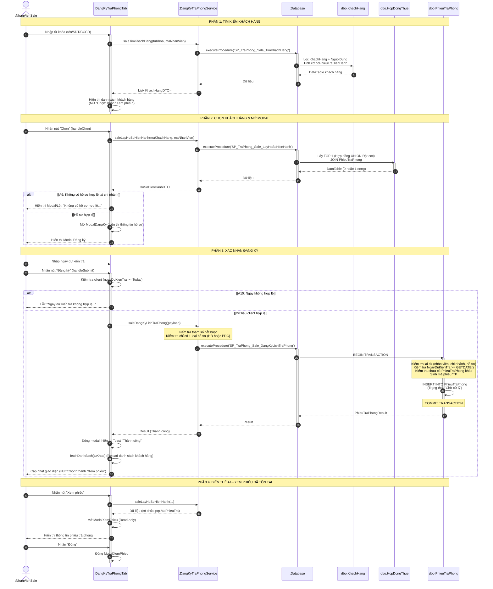

# Thiết kế chi tiết 3 lớp (3-Layer) & Sơ đồ tuần tự - Use Case: Đăng ký lịch trả phòng

Tài liệu này đặc tả cấu trúc thiết kế 3 lớp (Giao diện, Nghiệp vụ, Truy cập dữ liệu) và Sơ đồ tuần tự chi tiết cho chức năng **Đăng ký lịch trả phòng** dành cho tác nhân **Nhân viên Sale** của hệ thống HomeStayDorm.

---

## 1. Thiết kế các Lớp chi tiết (Class Design)

### 1.1. Tầng Giao Diện (GUI Layer)

**Tên lớp**: `DangKyTraPhongTab` (Frontend Component)

**Thuộc tính (UI Controls)**:

*   **Phần danh sách và tìm kiếm**:
    *   `- txtTimKiem: TextInput` (Tra cứu theo tên, SĐT, CCCD)
    *   `- chkLocDaTiepNhan: Checkbox` ("Chỉ hiện khách hàng đã tiếp nhận đăng ký trả phòng")
    *   `- dgvDanhSachKhachHang: GridView` (Lưới hiển thị: họ tên, giới tính, ngày sinh, SĐT, CCCD, Thao tác)
    *   `- btnChon: Button` (Mở modal đăng ký — khi `coPhieuTraHienHanh` = false)
    *   `- btnXemPhieu: Button` (Mở modal xem phiếu — khi `coPhieuTraHienHanh` = true)
*   **Modal Đăng ký lịch trả phòng (ModalDangKy)**:
    *   `- lblModalTitle: Label` ("Đăng ký lịch trả phòng")
    *   **Thông tin khách hàng**: `- lblHoTenKhach`, `- lblSdtKhach`
    *   **Thông tin hồ sơ (Hợp đồng / Phiếu đặt cọc)**: `- lblMaHoSo`, `- badgeTrangThaiHoSo`, `- lblThoiHan` / `- lblNgayDatCoc`, `- lblTienCoc`
    *   **Thông tin Phòng/Giường**: `- lblPhongGiuong`, `- lblHinhThucThue`
    *   **Input**: `- txtNgayDuKienTra: DateInput` (Có validate `min = today`)
    *   `- lblError: Label` (Hiển thị lỗi validate hoặc lỗi từ server)
    *   `- btnHuy: Button`, `- btnDangKy: Button`
*   **Modal Xem phiếu trả phòng (ModalXemPhieu)** (Chỉ đọc, biến thể A4):
    *   Hiển thị thông tin tương tự modal đăng ký, cộng thêm: `- lblNgayDuKienTra`, `- badgeTrangThaiPhieu`
    *   `- btnDong: Button`
*   **Thông báo (Toast)**:
    *   `- toastMsg: Toast` (Hiển thị thành công/lỗi tự động ẩn)

**Phương thức (Events & Helpers)**:

*   `+ fetchDanhSach(keyword: String): void` — Gọi API tải danh sách khách hàng.
*   `+ handleInputChange(e: Event): void` — Cập nhật từ khóa và debounce tìm kiếm.
*   `+ handleChon(khach: Object): void` — Click nút "Chọn", gọi API `saleLayHoSoHienHanh`. Nếu hợp lệ thì mở `ModalDangKy`, nếu rỗng/lỗi thì hiện lỗi (Biến thể A6).
*   `+ handleXemPhieu(khach: Object): void` — Click "Xem phiếu", gọi API và mở `ModalXemPhieu` (Biến thể A4).
*   `+ handleCloseModal(): void` — Đóng modal, reset state (Biến thể A8).
*   `+ handleSubmit(e: Event): void` (Bên trong `ModalDangKy`):
    1. Kiểm tra client-side: `txtNgayDuKienTra` không được để trống và phải $\ge$ ngày hiện tại (Biến thể A10).
    2. Gọi `dangKyTraPhongApi.saleDangKyLichTraPhong(...)`.
    3. Thành công: Gọi `handleSuccess()`. Lỗi: hiện `lblError`.
*   `+ handleSuccess(): void` — Đóng modal, hiện toast thành công, gọi `fetchDanhSach` để tải lại lưới.

---

### 1.2. Tầng Nghiệp Vụ (BUS Layer)

**Tên lớp**: `DangKyTraPhongService` (Backend Service)

**Thuộc tính**: Không có (Stateless)

**Phương thức**:

*   `+ <<static>> saleTimKhachHang(tuKhoa: String, maNhanVien: String): List<KhachHangDTO>`
    > Gọi `DB::SP_TraPhong_Sale_TimKhachHang`. Xử lý lỗi DB và ném `ServiceError` nếu cần.

*   `+ <<static>> saleLayHoSoHienHanh(maKhachHang: String, maNhanVien: String): HoSoHienHanhDTO`
    > Gọi `DB::SP_TraPhong_Sale_LayHoSoHienHanh`. 
    > Kiểm tra dữ liệu hợp lệ: `maKhachHang`, `maNhanVien`. Trả về `null` nếu không có hồ sơ hợp lệ.

*   `+ <<static>> saleDangKyLichTraPhong(body: RequestBody, maNhanVien: String): PhieuTraPhongResult`
    > **Ràng buộc nghiệp vụ (Business Rules)**:
    > 1. `maKhachHang`, `maNhanVien`, `ngayDuKienTra` không được bỏ trống.
    > 2. Phải có chính xác một trong hai: `maHopDong` hoặc `maPhieuDatCoc`. Nếu thiếu hoặc truyền cả hai đều ném lỗi 400.
    >
    > Chuyển tiếp xuống `DB::SP_TraPhong_Sale_DangKyLichTraPhong`. Bắt lỗi từ DB (như ngày không hợp lệ, không đúng chi nhánh, v.v.).

---

### 1.3. Tầng Truy Cập Dữ Liệu (DB Layer / DAL)

**Lớp Database**: Thực thi qua Stored Procedures (SQL Server)

*   `dbo.SP_TraPhong_Sale_TimKhachHang`
    | Tham số | Kiểu | Mô tả |
    |---|---|---|
    | `@TuKhoa` | NVARCHAR(100) | Tên, SĐT hoặc CCCD |
    | `@MaNhanVien` | VARCHAR(6) | Để xác định `@MaChiNhanh` |
    
    *Logic*: Tìm kiếm `TOP 50` khách hàng. Tính cờ `coPhieuTraHienHanh` (BIT) dùng truy vấn con: kiểm tra xem có hồ sơ Hợp đồng (Hiệu lực/Hết hạn) hoặc Đặt cọc (Hiệu lực, Đã TT) thuộc chi nhánh của nhân viên, và hồ sơ này đã có Phiếu Trả Phòng (`TrangThai <> 'Hủy'`) hay chưa.

*   `dbo.SP_TraPhong_Sale_LayHoSoHienHanh`
    | Tham số | Kiểu | Mô tả |
    |---|---|---|
    | `@MaKhachHang` | VARCHAR(6) | Mã KH cần lấy hồ sơ |
    | `@MaNhanVien` | VARCHAR(6) | Kiểm tra phân quyền chi nhánh |
    
    *Logic*: Lấy `TOP 1` hồ sơ sử dụng `UNION ALL` kết hợp bảng `HopDongThue` (ưu tiên) và `PhieuDatCoc`. `LEFT JOIN PhieuTraPhong` (`TrangThai <> 'Hủy'`) để trả về thông tin phiếu trả phòng nếu đã có.

*   `dbo.SP_TraPhong_Sale_DangKyLichTraPhong`
    | Tham số | Kiểu | Mô tả |
    |---|---|---|
    | `@MaKhachHang` | VARCHAR(6) | |
    | `@MaNhanVien` | VARCHAR(6) | |
    | `@MaHopDong` | VARCHAR(6) | NULL nếu dùng Đặt cọc |
    | `@MaPhieuDatCoc`| VARCHAR(6) | NULL nếu dùng Hợp đồng |
    | `@NgayDuKienTra`| DATE | Phải $\ge$ GETDATE() |

    *Logic* (Sử dụng `BEGIN TRANSACTION` và `SET XACT_ABORT ON`):
    1. Kiểm tra bắt buộc: các biến NULL, tính `@MaChiNhanh`.
    2. Kiểm tra `NgayDuKienTra >= GETDATE()` (THROW 50011).
    3. Nếu có `@MaHopDong`: Kiểm tra tồn tại, trạng thái (Hiệu lực/Hết hạn), thuộc chi nhánh. Kiểm tra chưa có phiếu trả khác (THROW 50011).
    4. Nếu có `@MaPhieuDatCoc`: Kiểm tra tồn tại, trạng thái (Hiệu lực, Đã TT), chưa lập HĐ, thuộc chi nhánh. Kiểm tra chưa có phiếu trả khác.
    5. Sinh mã tự động `TP####`.
    6. `INSERT INTO PhieuTraPhong` (trạng thái: `Chờ xử lý`, `NgayDangKyTra`: `GETDATE()`).
    7. `COMMIT` và `SELECT` dữ liệu phiếu vừa tạo.

---

## 2. Sơ đồ tuần tự (Sequence Diagram) - Luồng Đăng ký lịch trả phòng

