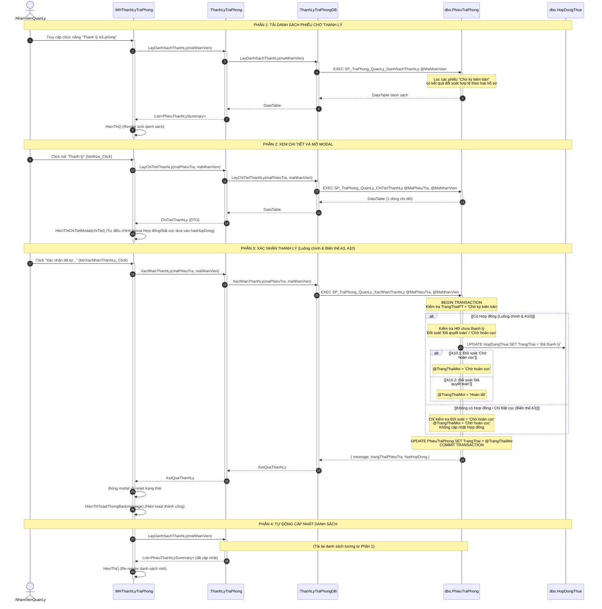

# Thiết kế chi tiết 3 lớp (3-Layer) & Sơ đồ tuần tự - Use Case: Thanh lý trả phòng

Tài liệu này đặc tả cấu trúc thiết kế 3 lớp (Giao diện, Nghiệp vụ, Truy cập dữ liệu) và Sơ đồ tuần tự chi tiết cho chức năng **Thanh lý trả phòng** dành cho tác nhân **Nhân viên Quản lý** của hệ thống HomeStayDorm. Toàn bộ giao diện chính, modal xem chi tiết và xác nhận thanh lý được gộp chung vào lớp Giao diện `MHThanhLyTraPhong` để khớp với thực tế lập trình.

---

## 1. Thiết kế các Lớp chi tiết (Class Design)

### 1.1. Tầng Giao Diện (GUI Layer)
Lớp đại diện cho màn hình thực hiện chức năng, chứa danh sách phiếu trả phòng ở trạng thái chờ ký biên bản/thanh lý và modal để nhân viên quản lý xác nhận tác vụ.

*   **Tên lớp**: `MHThanhLyTraPhong`
*   **Thuộc tính (UI Controls)**:
    *   **Phần danh sách và bộ lọc (Trang chính)**:
        *   `- txtTimKiem: TextBox` (Tra cứu theo tên khách, SĐT, mã phiếu trả phòng, mã đối soát)
        *   `- btnFilterTatCa: Button`, `- btnFilterChoKy: Button`, `- btnFilterDaKy: Button` (Các chip nút lọc trạng thái thanh lý)
        *   `- dgvDanhSachThanhLy: GridView` (Lưới hiển thị: mã phiếu trả, khách hàng, phòng/giường, mã đối soát, ngày đăng ký, trạng thái, thao tác)
        *   `- btnRowThanhLy: Button` (Nút "Thanh lý" hiển thị trên dòng phiếu đang `Chờ ký biên bản`)
        *   `- btnRowXemChiTiet: Button` (Nút "Xem chi tiết" hiển thị trên dòng phiếu đã thanh lý/ký biên bản)
    *   **Modal Thanh lý hồ sơ**:
        *   `- lblModalTitle: Label` ("Thanh lý hồ sơ")
        *   `- btnDongModal: Button` (Nút X đóng modal)
        *   **Card Thông tin phiếu trả phòng**: `- lblMaPhieuTra`, `- lblNgayDangKy`, `- lblNgayTraThucTe`, `- badgeTrangThaiPhieuTra`
        *   **Card Khách hàng**: `- lblHoTenKhach`, `- lblSdtKhach`, `- lblCccdKhach`
        *   **Card Hồ sơ lưu trú**: `- lblLoaiHoSo` (Hợp đồng thuê / Phiếu đặt cọc), `- lblMaHoSo`, `- badgeTrangThaiHoSo`
        *   **Card Phòng/Giường**: `- lblKhuVuc`, `- lblPhongGiuong` (ghép Tên phòng và Mã giường), `- lblHinhThucThue`
        *   **Card Kết quả đối soát**: `- lblMaDoiSoat`, `- lblKetQua` (Số tiền được hoàn / Số tiền thu thêm / Không phát sinh), `- badgeTrangThaiDoiSoat`, `- lnkChungTuDoiSoat` (Link Xem chứng từ hoặc nhãn Chờ kế toán hoàn cọc)
        *   `- btnXacNhanThanhLy: Button` ("Xác nhận thanh lý hồ sơ"; chỉ hiển thị khi trạng thái là `Chờ ký biên bản`)
        *   `- btnDong: Button` (Nút "Đóng" modal)
    *   **Toast Thông báo thành công**:
        *   Hiển thị dòng thông báo màu xanh góc dưới màn hình (ví dụ: "Thanh lý trả phòng thành công.") tự động ẩn sau 3 giây.

*   **Phương thức (Events & Helpers)**:
    *   `+ HienThi(): void` (Gọi `ThanhLyTraPhong::LayDanhSachThanhLy`, nạp lên UI với bộ lọc client-side)
    *   `+ btnFilter_Click(trangThaiLoc: String): void` (Lọc danh sách theo 'Tất cả' / 'Chờ ký biên bản' / 'Đã ký biên bản')
    *   `+ txtTimKiem_Change(tuKhoa: String): void` (Lọc dữ liệu trên lưới theo từ khóa)
    *   `+ btnRow_Click(phieu: PhieuThanhLy): void` (Gọi `ThanhLyTraPhong::LayChiTietThanhLy(maPhieuTra)` và mở Modal Thanh lý hồ sơ)
    *   `+ HienThiChiTietModal(chiTiet: ChiTietThanhLy): void` (Render các thông tin lên modal, điều chỉnh layout dựa theo cờ `hasHopDong`)
    *   `+ getDoiSoatResult(chiTiet): Object` (Hàm helper xác định trạng thái và màu sắc kết quả tài chính để hiển thị trên UI)
    *   `+ btnXacNhanThanhLy_Click(): void` (Gọi `ThanhLyTraPhong::XacNhanThanhLy(maPhieuTra)`. Sau khi thành công, đóng Modal, hiển thị Toast Thông báo và reload danh sách)

---

### 1.2. Tầng Nghiệp Vụ (BUS Layer)

#### Lớp: `ThanhLyTraPhong` (Thực thể Nghiệp vụ Thanh lý)
*   **Thuộc tính**: Không có trạng thái lưu trữ nội bộ (Stateless service)
*   **Phương thức**:
    *   `+ <<static>> LayDanhSachThanhLy(maNhanVien: String): List<PhieuThanhLySummary>`
        > Gọi `ThanhLyTraPhongDB::LayDanhSachThanhLy`. Lấy các phiếu trả phòng đang chờ thanh lý (`Chờ ký biên bản`) hoặc đã xử lý (`Chờ hoàn cọc`, `Hoàn tất`), nhưng có đối soát phù hợp với logic thanh lý.

    *   `+ <<static>> LayChiTietThanhLy(maPhieuTra: String, maNhanVien: String): ChiTietThanhLy`
        > Gọi `ThanhLyTraPhongDB::LayChiTietThanhLy` để lấy chi tiết hiển thị modal. Trả về thông tin khách hàng, phòng, hợp đồng/đặt cọc, và đối soát.

    *   `+ <<static>> XacNhanThanhLy(maPhieuTra: String, maNhanVien: String): KetQuaThanhLy`
        > **Kiểm tra ràng buộc nghiệp vụ (Business Rules)**:
        > 1. Phiếu trả phòng phải tồn tại, thuộc quyền quản lý của nhân viên.
        > 2. Phiếu phải ở trạng thái `'Chờ ký biên bản'` (E10).
        > 3. Nếu là hợp đồng: Đối soát phải là `'Đã quyết toán'` hoặc `'Chờ hoàn cọc'`. Hợp đồng chưa được `'Đã thanh lý'`.
        > 4. Nếu là đặt cọc: Đối soát phải là `'Chờ hoàn cọc'`.
        > 
        > Chuyển tiếp lời gọi cho DB thực hiện trong 1 Transaction. Cập nhật trạng thái Hợp đồng (nếu có) và Phiếu trả phòng.

#### Lớp: `PhieuThanhLySummary` (DTO - Danh sách)
*   **Thuộc tính**:
    *   `- MaPhieuTra: String`, `- NgayDangKyTra: Date`, `- NgayTraThucTe: Date`, `- TrangThai: String`
    *   `- MaDoiSoat: String`, `- TrangThaiDoiSoat: String`
    *   `- HoTenKhach: String`, `- SdtKhach: String`
    *   `- TenPhong: String`, `- MaGiuong: String`
    *   `- TrangThaiHopDong: String`, `- LoaiNguon: String` (`'HopDong'` / `'DatCoc'`)

#### Lớp: `ChiTietThanhLy` (DTO - Chi tiết trong Modal)
*   **Thuộc tính**:
    *   `- MaPhieuTra: String`, `- NgayDangKyTra: Date`, `- NgayTraThucTe: Date`, `- TrangThaiPhieuTra: String`
    *   `- MaDoiSoat: String`, `- TrangThaiDoiSoat: String`, `- SoTienHoanThucTe: Decimal`, `- SoTienKhachPhaiTT: Decimal`, `- ChungTuThanhToan: String`, `- PhuongThucThanhToan: String`
    *   `- HasHopDong: Boolean`
    *   *(Nếu có Hợp đồng)*: `- MaHopDong: String`, `- NgayBatDauHopDong: Date`, `- NgayKetThucHopDong: Date`, `- TrangThaiHopDong: String`
    *   *(Nếu có Đặt cọc)*: `- MaPhieuDatCoc: String`, `- NgayDatCoc: Date`, `- TrangThaiCoc: String`
    *   `- HoTenKhach: String`, `- SoDienThoai: String`, `- CccdKhach: String`
    *   `- TenPhong: String`, `- MaGiuong: String`, `- KhuVuc: String`, `- HinhThucThue: String`, `- TrangThaiPhong: String`, `- SucChuaToiDa: Int`

---

### 1.3. Tầng Truy Cập Dữ Liệu (DB Layer / DAL)

#### Lớp: `ThanhLyTraPhongDB`
*   **Phương thức**:
    *   `+ <<static>> LayDanhSachThanhLy(maNhanVien: String): DataTable` ➔ Gọi stored procedure `dbo.SP_TraPhong_QuanLy_DanhSachThanhLy`
        | Tham số SP | Kiểu | Mô tả |
        |---|---|---|
        | `@MaNhanVien` | VARCHAR(6) | Mã NV quản lý (lọc theo chi nhánh) |
        
        **Logic**: Lọc phiếu trả phòng tại chi nhánh với điều kiện:
        - `Chờ ký biên bản` và (HĐ + Đối soát `Đã quyết toán`/`Chờ hoàn cọc` + HĐ chưa `Đã thanh lý`)
        - `Chờ ký biên bản` và (Không HĐ + Đối soát `Chờ hoàn cọc`)
        - Hoặc phiếu đã ở `Chờ hoàn cọc`, `Hoàn tất`

    *   `+ <<static>> LayChiTietThanhLy(maPhieuTra: String, maNhanVien: String): DataTable` ➔ Gọi stored procedure `dbo.SP_TraPhong_QuanLy_ChiTietThanhLy`
        | Tham số SP | Kiểu | Mô tả |
        |---|---|---|
        | `@MaPhieuTra` | VARCHAR(6) | Mã phiếu trả |
        | `@MaNhanVien` | VARCHAR(6) | Mã NV quản lý |
        
        **Logic**: Trả về 1 dòng chi tiết kết hợp dữ liệu PhieuTraPhong, DoiSoat, HopDongThue, PhieuDatCoc, KhachHang, Phong, Giuong. Có cờ tính toán logic `hasHopDong`.

    *   `+ <<static>> XacNhanThanhLy(maPhieuTra: String, maNhanVien: String): DataTable` ➔ Gọi stored procedure `dbo.SP_TraPhong_QuanLy_XacNhanThanhLy`
        | Tham số SP | Kiểu | Mô tả |
        |---|---|---|
        | `@MaPhieuTra` | VARCHAR(6) | Mã phiếu trả cần thanh lý |
        | `@MaNhanVien` | VARCHAR(6) | Mã NV quản lý |

        **Logic SP** (trong 1 transaction với `SET XACT_ABORT ON`):
        1. Kiểm tra phiếu có tồn tại, thuộc quyền quản lý và ở trạng thái `Chờ ký biên bản` hay không (Ném THROW nếu vi phạm).
        2. **Nếu có Hợp đồng**:
            - Bắt buộc Đối soát ∈ (`Đã quyết toán`, `Chờ hoàn cọc`).
            - Bắt buộc HĐ chưa `Đã thanh lý`.
            - `UPDATE HopDongThue SET TrangThai = N'Đã thanh lý'`.
            - Cập nhật Phiếu Trả Phòng: nếu Đối soát = `Chờ hoàn cọc` thì `Chờ hoàn cọc`, ngược lại `Hoàn tất`.
        3. **Nếu là Đặt cọc (Biến thể A3)**:
            - Bắt buộc Đối soát = `Chờ hoàn cọc`.
            - Cập nhật Phiếu Trả Phòng: `Chờ hoàn cọc`.
        4. Trả về `message`, `trangThaiPhieuTra`, `hasHopDong`.

---

## 2. Sơ đồ tuần tự (Sequence Diagram) - Luồng Thanh lý trả phòng

