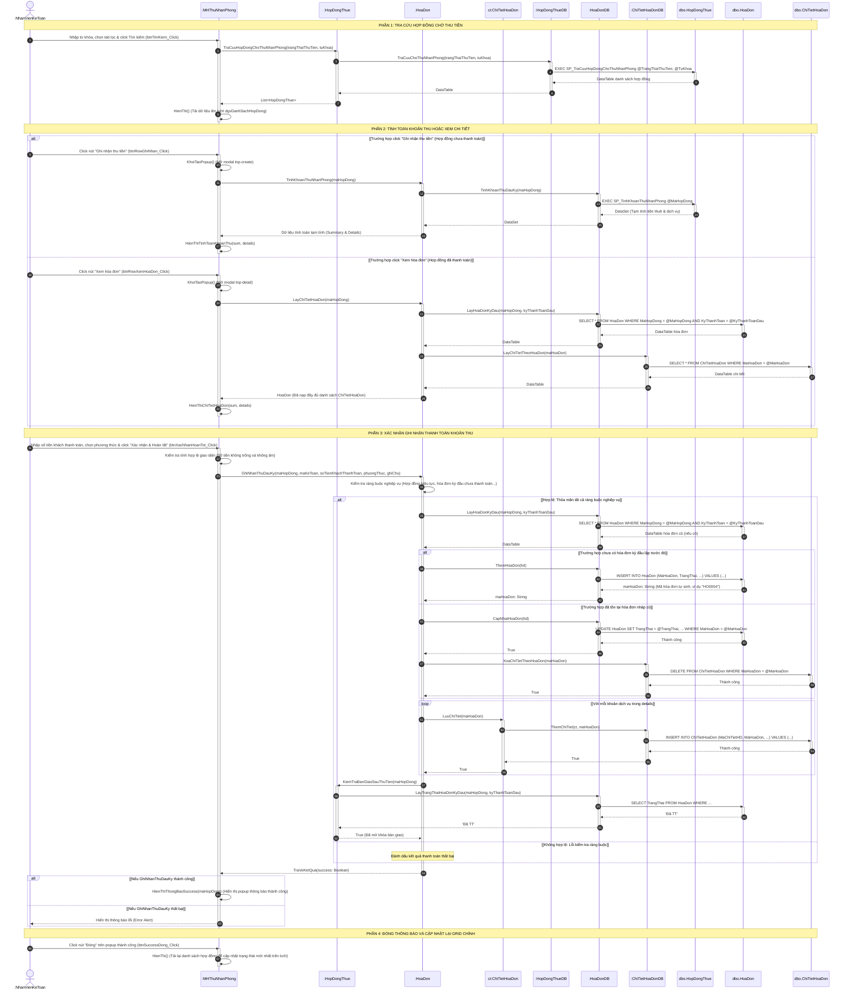

# Thiết kế chi tiết 3 lớp (3-Layer) & Sơ đồ tuần tự - Use Case: Thu nhận phòng (Ghi nhận khoản thu nhận phòng)

Tài liệu này đặc tả cấu trúc thiết kế 3 lớp (Giao diện, Nghiệp vụ, Truy cập dữ liệu) và Sơ đồ tuần tự chi tiết cho chức năng **Thu nhận phòng (Ghi nhận khoản thu nhận phòng của khách hàng vào đầu kỳ)** dành cho tác nhân **Nhân viên Kế toán** của hệ thống HomeStayDorm. Toàn bộ giao diện chính và các modal popup (tính toán/ghi nhận thu tiền, chi tiết hóa đơn, thông báo thành công) đều được gộp chung vào lớp Giao diện `MHThuNhanPhong` để khớp 100% với thực tế lập trình.

---

## 1. Thiết kế các Lớp chi tiết (Class Design)

### 1.1. Tầng Giao Diện (GUI Layer)
Lớp đại diện cho màn hình thực hiện chức năng, chứa tất cả các control giao diện (bao gồm các ô nhập liệu, danh sách và nút tương tác trên trang chính lẫn các popup xử lý).

*   **Tên lớp**: `MHThuNhanPhong`
*   **Thuộc tính (UI Controls)**:
    *   **Phần bộ lọc và tìm kiếm (Trang chính)**:
        *   `- txtTuKhoa: TextBox` (Tìm mã hợp đồng, tên khách hàng hoặc số điện thoại)
        *   `- btnTimKiem: Button` (Nút bấm thực hiện tìm kiếm)
        *   `- btnFilterChuaThanhToan: Button`, `- btnFilterDaThanhToan: Button`, `- btnFilterTatCa: Button` (Các chip nút lọc trạng thái thu tiền)
        *   `- dgvDanhSachHopDong: GridView` (Lưới hiển thị danh sách hợp đồng chờ thu/đã thu tiền nhận phòng)
        *   `- btnRowGhiNhan: Button` (Nút "Ghi nhận thu tiền" trên dòng hợp đồng chưa thu tiền)
        *   `- btnRowXemHoaDon: Button` (Nút "Xem hóa đơn" trên dòng hợp đồng đã thu tiền)
    *   **Popup Ghi nhận khoản thu nhận phòng (Modal tnp-create)**:
        *   `- lblTieuDeModal: Label` (Hiển thị tiêu đề "Ghi nhận khoản thu nhận phòng")
        *   `- btnDongModal: Button` (Nút X để đóng popup)
        *   `- lblTenKhach: Label`, `- lblPhongGiuong: Label`, `- lblMaHopDong: Label` (Hiển thị tóm tắt thông tin hợp đồng cần thu)
        *   `- dgvChiTietTinhToan: GridView` (Hiển thị chi tiết tính toán: tiền thuê kỳ đầu, các dịch vụ đi kèm)
        *   `- lblTongCongCanThu: Label` (Hiển thị tổng số tiền cần phải thu)
        *   `- txtSoTienThucNop: TextBox` (Ô nhập số tiền khách nộp thực tế)
        *   `- cboPhuongThucTT: ComboBox` (Dropdown chọn: Chuyển khoản / Tiền mặt)
        *   `- txtGhiChuThanhToan: TextBox` (TextArea nhập ghi chú chuyển khoản, người chuyển...)
        *   `- btnXacNhanHoanTat: Button` (Nút "Xác nhận & Hoàn tất")
        *   `- btnHuy: Button`
    *   **Popup Chi tiết Hóa đơn đã thu (Modal tnp-detail)**:
        *   `- lblDetailTieuDe: Label`, `- lblDetailMaHopDong: Label`
        *   `- lblDetailTrangThai: Label` (Badge hiển thị "Đã thanh toán")
        *   `- lblDetailNgayTT: Label` (Hiển thị ngày khách thanh toán thực tế)
        *   `- dgvDetailKhoanThu: GridView` (Lưới hiển thị chi tiết các khoản đã thu)
        *   `- lblDetailTongTien: Label`, `- lblDetailPhuongThuc: Label`, `- lblDetailKeToanThu: Label`
        *   `- btnDetailDong: Button`
    *   **Popup Thành công (Success PopUp)**:
        *   `- lblSuccessTitle: Label` ("Thu tiền kỳ đầu thành công")
        *   `- lblSuccessMessage: Label` (Hiển thị nội dung hoàn tất thu tiền)
        *   `- btnSuccessDong: Button`
*   **Phương thức (Events & Helpers)**:
    *   `+ HienThi(): void` (Nạp dữ liệu từ CSDL lên Grid chính `dgvDanhSachHopDong`)
    *   `+ btnTimKiem_Click(): void` (Kích hoạt tìm kiếm hợp đồng theo từ khóa)
    *   `+ btnFilter_Click(trangThai: String): void` (Lọc danh sách theo trạng thái thu tiền)
    *   `+ dgvDanhSachHopDong_CellClick(maHopDong: String): void` (Bắt sự kiện click để phân loại mở popup chi tiết hoặc thu tiền)
    *   `+ btnRowGhiNhan_Click(maHopDong: String): void` (Mở popup ghi nhận thu tiền, gọi `HoaDon::TinhKhoanThuNhanPhong`)
    *   `+ HienThiTinhToanKhoanThu(sum: Summary, details: List<CalculationDetail>): void` (Hiển thị dữ liệu tính toán lên popup ghi nhận)
    *   `+ btnXacNhanHoanTot_Click(): void` (Kiểm tra ràng buộc số tiền không âm và gọi `HoaDon::GhiNhanThuDauKy`)
    *   `+ btnRowXemHoaDon_Click(maHopDong: String): void` (Mở popup xem hóa đơn, gọi `HoaDon::LayChiTietHoaDon`)
    *   `+ HienThiChiTietHoaDon(sum: Summary, details: List<CalculationDetail>): void` (Hiển thị dữ liệu chi tiết hóa đơn đã thanh toán)
    *   `+ HienThiThongBaoSuccess(maHopDong: String): void` (Mở popup thành công)
    *   `+ btnSuccessDong_Click(): void` (Đóng popup thành công và re-render danh sách hợp đồng)

---

### 1.2. Tầng Nghiệp Vụ (BUS Layer)

#### Lớp: `HopDongThue` (Thực thể Hợp đồng thuê)
*   **Thuộc tính**:
    *   `- MaHopDong: String`
    *   `- MaKhachHang: String`
    *   `- NgayBatDau: Date`
    *   `- GiaThue: Decimal`
    *   `- KyThanhToan: String`
    *   `- TrangThai: String`
*   **Phương thức**:
    *   `+ <<static>> TraCuuHopDongChoThuNhanPhong(trangThaiThuTien: String, tuKhoa: String): List<HopDongThue>` (Gọi `HopDongThueDB::TraCuuChoThuNhanPhong`)
    *   `+ <<static>> KiemTraBanGiaoSauThuTien(maHopDong: String): Boolean` (Kiểm tra điều kiện để mở khóa quyền lập biên bản bàn giao phòng cho Sale, gọi `HoaDonDB::LayTrangThaiHoaDonKyDau`)

#### Lớp: `HoaDon` (Thực thể Hóa đơn)
*   **Thuộc tính**:
    *   `- MaHoaDon: String`
    *   `- KyThanhToan: String` (Dạng định dạng 'yyyy-MM')
    *   `- NgayLap: Date`
    *   `- NgayHanTT: Date`
    *   `- TongTien: Decimal`
    *   `- TrangThai: String` (Chưa TT / Đã TT)
    *   `- NgayThanhToan: Date`
    *   `- PhuongThucThanhToan: String` (Chuyển khoản / Tiền mặt)
    *   `- MaHopDong: String`
    *   `- MaNhanVienKeToan: String`
*   **Phương thức**:
    *   `+ <<static>> TinhKhoanThuNhanPhong(maHopDong: String): Dynamic` (Gọi `HoaDonDB::TinhKhoanThuDauKy` để lấy thông tin tạm tính gồm các dòng tiền thuê kỳ đầu và dịch vụ)
    *   `+ <<static>> LayChiTietHoaDon(maHopDong: String): HoaDon` (Gọi `HoaDonDB::LayHoaDonKyDau` và `ChiTietHoaDonDB::LayChiTietTheoHoaDon` để lấy thông tin chi tiết hóa đơn đã thu)
    *   `+ <<static>> GhiNhanThuDauKy(maHopDong: String, maKeToan: String, soTienKhachThanhToan: Decimal, phuongThuc: String, ghiChu: String): Boolean`
        > **Kiểm tra ràng buộc nghiệp vụ (Business Rules)**:
        > 1. Phương thức thanh toán phải hợp lệ (Chỉ nhận "Tiền mặt" hoặc "Chuyển khoản").
        > 2. Số tiền khách thanh toán phải >= 0 và không được để trống.
        > 3. Hợp đồng phải ở trạng thái "Hiệu lực".
        > 4. Hợp đồng có giá thuê hợp lệ và tổng số tiền cần thu kỳ đầu phải lớn hơn 0.
        > 5. Hóa đơn kỳ đầu của hợp đồng này chưa từng được thanh toán trước đó (trạng thái khác "Đã TT").

#### Lớp: `ChiTietHoaDon` (Thực thể Chi tiết hóa đơn)
*   **Thuộc tính**:
    *   `- MaChiTietHD: String`
    *   `- MaHoaDon: String`
    *   `- LoaiChiPhi: String` (Dịch vụ)
    *   `- SoLuong: Decimal`
    *   `- DonGia: Decimal`
    *   `- ThanhTien: Decimal`
    *   `- GhiChu: String`
    *   `- MaChiTietDVHD: String`
*   **Phương thức**:
    *   `+ LuuChiTiet(maHoaDon: String): Boolean` (Gọi `ChiTietHoaDonDB::ThemChiTiet` để lưu chi tiết hóa đơn dịch vụ vào CSDL)

---

### 1.3. Tầng Truy Cập Dữ Liệu (DB Layer / DAL)

#### Lớp: `HopDongThueDB`
*   **Phương thức**:
    *   `+ <<static>> TraCuuChoThuNhanPhong(trangThaiThuTien: String, tuKhoa: String): DataTable` ➔ Gọi stored procedure `dbo.SP_TraCuuHopDongChoThuNhanPhong`

#### Lớp: `HoaDonDB`
*   **Phương thức**:
    *   `+ <<static>> TinhKhoanThuDauKy(maHopDong: String): DataSet` ➔ Gọi stored procedure `dbo.SP_TinhKhoanThuNhanPhong`
    *   `+ <<static>> LayHoaDonKyDau(maHopDong: String, kyThanhToan: String): DataTable` ➔ Truy vấn lấy thông tin hóa đơn kỳ đầu hiện tại của hợp đồng
    *   `+ <<static>> ThemHoaDon(hd: HoaDon): String` ➔ INSERT hóa đơn mới và trả về `MaHoaDon` tự sinh (ví dụ: "HO0004")
    *   `+ <<static>> CapNhatHoaDon(hd: HoaDon): Boolean` ➔ UPDATE hóa đơn đã tồn tại sang trạng thái thanh toán mới
    *   `+ <<static>> LayTrangThaiHoaDonKyDau(maHopDong: String, kyThanhToan: String): String` ➔ Trả về trạng thái thanh toán của hóa đơn kỳ đầu

#### Lớp: `ChiTietHoaDonDB`
*   **Phương thức**:
    *   `+ <<static>> XoaChiTietTheoHoaDon(maHoaDon: String): Boolean` ➔ DELETE các chi tiết cũ của hóa đơn (được dùng khi ghi nhận đè/cập nhật lại hóa đơn cũ chưa thanh toán)
    *   `+ <<static>> ThemChiTiet(ct: ChiTietHoaDon, maHoaDon: String): Boolean` ➔ INSERT mới một chi tiết hóa đơn dịch vụ
    *   `+ <<static>> LayChiTietTheoHoaDon(maHoaDon: String): DataTable` ➔ SELECT danh sách chi tiết các khoản phí dịch vụ đã thu thuộc hóa đơn

---

## 2. Sơ đồ tuần tự (Sequence Diagram) - Luồng Ghi nhận thu nhận phòng

