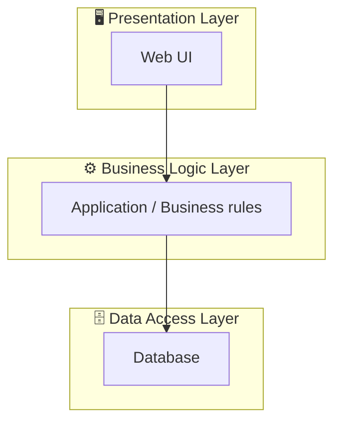

# 🏠 HomeStayDorm – Dormitory / Homestay Room Rental Management System

> Practical project for the **Information Systems Analysis and Design (ISAD)** course
> 🔗 Live demo: [home-stay-dorm.vercel.app](https://home-stay-dorm.vercel.app)

An end-to-end management system for homestay/dorm room rental operations, covering room browsing, booking, contracts, payments, and administration.

---

## 📌 Introduction

### Problem Statement
*(2-3 sentences: what real-world problem does this solve — e.g. manual room/tenant management is error-prone, hard to track contracts, payments, room status...)*

### Scope
*(what the system covers / does not cover — e.g. room management, booking, contracts, billing; excludes X, Y)*

### How the System Works

A quick overview of the operational flow by role, so a first-time reader understands the system before diving into the use case diagrams:

- **Customer:** browse available rooms → reserve & pay a deposit → sign the lease contract → check-in → pay monthly bills → request check-out
- **Sale Staff:** follow up on booking requests, schedule room viewings, draft lease contracts
- **Branch Manager:** approve deposits, handle check-in/check-out inspections, manage room/asset status
- **Accountant:** generate monthly bills, reconcile damages, process deposit refunds
- **Admin:** manage system-wide catalogs (users, room types, branches, services)

*(Adjust the roles/flow above to match your actual system.)*

---

## 👥 Team Information

| Student ID | Full Name | Role & Contributions |
|---|---|---|
| ... | ... | Business/system use case analysis, database design |
| ... | ... | UI design, frontend development |
| ... | ... | Backend development, deployment |

---

## 🛠️ Tech Stack

- **Frontend:** *(e.g. React / plain HTML-CSS-JS)*
- **Backend:** *(e.g. Node.js / ASP.NET)*
- **Database:** *(e.g. SQL Server / MySQL)*
- **Deployment:** Vercel
- **Diagramming tools:** draw.io / StarUML / Visual Paradigm

---

## 📄 Project Documents

Full specifications, analysis, and design documentation are kept outside the repo due to file size and linked here instead of being embedded:

- **Project specification (PDF):** [link]
- **Full design report (DOCX)** — detailed use case specifications, class diagrams, sequence diagrams, ERD: [link to Google Drive / OneDrive]

---

## 🏗️ System Architecture

The system follows a **3-layer architecture** (Presentation – Business Logic – Data Access).



*(Replace this diagram with your actual architecture once components are finalized.)*

---

## 📊 Business Analysis & Use Cases

### Actors

1. **Actor 1** — *(description)*
2. **Actor 2** — *(description)*
3. **Actor 3** — *(description)*

### Business Use Case Diagram
[](docs/diagrams/business-usecase.png)

### System Use Case Diagram
[](docs/diagrams/system-usecase.png)

The system supports **N use cases** covering all core requirements. Full use case specifications (actors, preconditions, main/alternative flows) are available in the detailed report linked above.

### Activity Diagram
[](docs/diagrams/activity-diagram.png)
*Example: room booking process.*

### Sequence Diagram
[](docs/diagrams/sequence-diagram.png)

### Class Diagram — 3-Layer Architecture
[](docs/diagrams/class-diagram.png)
*Presentation – Business Logic – Data Access layers and their interactions.*

---

## 🗄️ Database Design (ERD)
[](docs/diagrams/erd.png)

Brief description of the main tables and their relationships. *(Full schema in the report.)*

---

## 🎨 UI Design

Initial UI mockups were designed with **Google Stitch** and used as a reference for implementation. See [`docs/mockups/`](docs/mockups) for the original design files.

| Home | Booking | Admin |
|:---:|:---:|:---:|
|  |  |  |

---

## 📁 Project Structure

```
HomeStayDorm/
├── docs/
│   ├── diagrams/        # use case, sequence, class diagram, ERD images
│   ├── mockups/         # original Google Stitch UI mockups (reference)
│   └── screenshots/     # actual application screenshots
├── database/             # SQL scripts / DB backup
├── Web/                  # application source code
├── README.md
└── .gitignore
```

---

## 🚀 Getting Started

1. Clone the repository:
   ```bash
   git clone https://github.com/NhatVy177/HomeStayDorm.git
   ```
2. Install dependencies:
   ```bash
   npm install
   ```
3. Configure the database connection *(env file / connection string)*.
4. Run the application:
   ```bash
   npm start
   ```

---

## 📞 Contact

- Team: *(links/emails if needed)*
- Instructor: *(if needed)*
